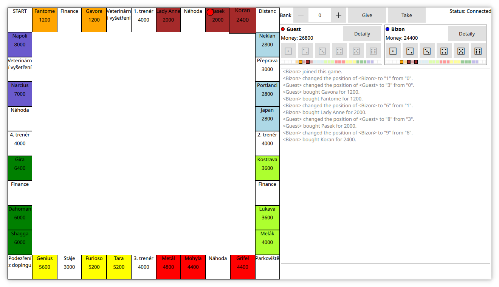

# Karantény a dostihy

Zcela legální implementace hry Dostihy a sázky pro desktop (Linux, macOS, Windows). macOS a Windows verze nejsou podepsaný, takže k instalaci bude potřeba proklikat se skrz nadávající dialogy (na macOS tuším Cmd+Right Click a pak Open).

Jádro běží komplet na serveru, klient zobrazuje jen data z něj. 

Server jde rozjet lokálně (i když ještě nejde nastavit ani port ani adresa, na který má poslouchat - v klientovi to ale nastavit jde). Každej hráč musí v současný době hrát ve vlastním okně s hrou, protože jsem na takovou možnost při vývoji vůbec nemyslel, karanténa je karanténa.

Kdyby to někdo chtěl kompilovat, je potřeba mít Qt ve verzi aspoň 5.12 a CMake. Pak by mělo stačit tohle:

```
mkdir build
cd build
cmake ..
make
```

Případně [tady](.github/workflows/main.yml) je konfigurace CI/CD, podle který se vyrábí [soubory ke stažení](https://github.com/MartinBriza/KarantenyADostihy/releases).



Todo list:

Tučně věci, co by měly bejt hotový pro 1.0

- [ ] Roster
  - [x] Vytváření místností
  - [x] Připojování se do místností
  - [ ] Zaheslované místnosti
  - [ ] Zobrazení běžících her s chybějícími hráči
   
- [ ] Lobby
  - [x] Chat
  - [x] Zobrazení ostatních hráčů
  - [ ] Ready stav by měl ovlivnit, jestli jde zapnout hra
  - [ ] Nastavení parametrů hry
    - [ ] Počet hráčů
    - [ ] Heslo
    - [ ] Skutečně řešit kdo hru vlastní (teď ji vlastní první hráč v seznamu a nemá vyšší práva než ostatní)
     
- [ ] Hra
  - [x] Pohyb figurek
  - [ ] **Pořadí hráčů**
  - [ ] **Kostka na serveru**
  - [x] Nákup karet
  - [x] Zobrazení náhody a financí
  - [ ] **Efekty náhody a financí**
    - [ ] Sekvenční výběr karet (teď zcela náhodně)
    - [x] Pohyb o X polí
    - [ ] **Pohyb na konkrétní dané pole**
    - [x] Zisk, ztráta a přesun peněz (narozeniny)
    - [x] Poplatky podle počtu obsazených dostihů
    - [ ] **Poplatky podle hozeného počtu kroků**
    - [ ] **Stání**
    - [ ] **Zrušený distanc**
      - [ ] **Možnost vlastnit zrušený distanc**
  - [ ] **Nákup dostihů**
  - [ ] **Poplatek při vstupu na cizí pole**
  - [ ] Sázky na pole před tahem (na který nikdy nikdo nehrál)
   
- [ ] Server detaily
  - [ ] Držet stav hráče i když skončí jeho socket
  - [ ] NTH Ukládat stav pro připad pádu
  
- [ ] Klient detaily
  - [ ] Lepší UI
  - [ ] Překlady, nebo se aspoň rozhodnout, jestli to teda bude česky nebo anglicky
   
- [ ] Web UI
  - [ ] Vůbec se rozhodnout jak to udělat
    
     
